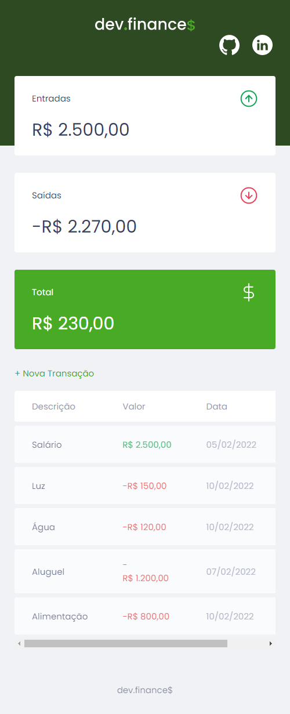

<h1 align="center"> 💻- Projeto Dev.Finance</h1>

<h2 align="center"> Descrição do Projeto <h2>

Este projeto trata-se de uma aplicação apresentada pelo <a href="https://www.instagram.com/maykbrito/"><strong>Mayk Brito</strong></a> da <a href="https://www.rocketseat.com.br/">Rocketseat</a>, durante a maratona do Discover, cujo sua funcionabilidade principal é criar uma ferramente para um controle financeiro. 
Realizamos a criação dos elementos da página, estilização e criação das funcionabilidades através do javascript.

   O projeto funciona com entradas e saídas de transações para um controle financeiro, utilizamos o local storage do browser para salvar as transações dos usuários, desta forma é possível manter todas as transaçãos feitas pelo usuário a qualquer momento.

<h2 align="center"> Imagens do Projeto <h2>

 
   
   

<h1 align="center">
   Ferramentas Utilizadas
</h1>
<h2 align="center">

